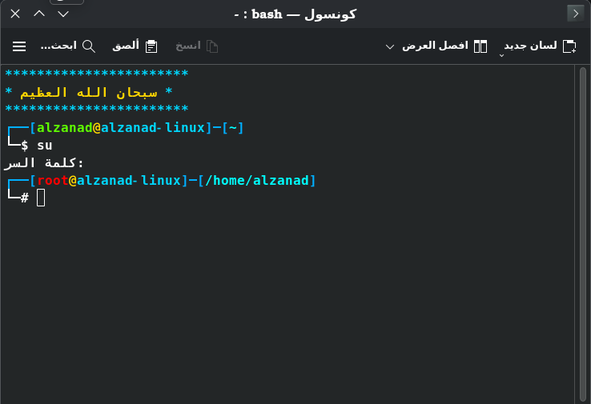

# ملف إعدادات باش متكامل

هذا الملف هو مجموعة شاملة من التحسينات والإضافات لبيئة Bash، مصممة لجعل تجربتك على سطر الأوامر أكثر إنتاجية، أمانًا، وجمالًا. 

## المميزات الرئيسية

### 1. موجه أوامر احترافي ومخصص

تم تصميم الطرفية كطرفية توزيعة كالي لنيكس.
- **ألوان مميزة:**
    - تمييز المستخدم الجذر (`root`) باللون الأحمر لتحذيرك.
    - ألوان مختلفة لاسم المستخدم، اسم الجهاز، والمسار الحالي.
- **اكتشاف الحاويات:** يكتشف تلقائيًا إذا كنت تعمل داخل بيئة `chroot` أو حاوية (مثل Docker, LXC) ويعرض اسم الحاوية في شريط عنوان النافذة.
- **عنوان النافذة:** يقوم بتحديث عنوان نافذة الطرفية ديناميكيًا ليعرض المستخدم، الجهاز، والمسار الحالي.

### 2. إدارة الأوامر المفضلة مع دالة `fav`

أداة قوية لحفظ وإدارة الأوامر التي تستخدمها بشكل متكرر.
- `fav add <command>`: لإضافة أمر جديد إلى قائمتك المفضلة.
- `fav list`: لعرض جميع الأوامر المحفوظة مع أرقامها.
- `fav del <number>`: لحذف أمر من القائمة باستخدام رقمه.
- `fav <number>`: لتشغيل أمر مباشرة من القائمة.

### 3. دالة `extract` الشاملة لفك الضغط

وداعاً لتذكر الأوامر المختلفة لكل صيغة ضغط. دالة `extract` تتعامل مع معظم الصيغ الشائعة بذكاء:
- **دعم واسع:** تفك ضغط ملفات `tar.gz`, `tar.bz2`, `tar.xz`, `zip`, `rar`, `7z`, `zst` وغيرها الكثير.
- **تحقق ذكي:** قبل محاولة فك ضغط صيغ مثل `.rar` أو `.7z`، تتحقق الدالة من وجود الأداة المطلوبة (`unrar`, `7z`) وتُعلمك إذا كانت غير مثبتة.
- **رسائل واضحة:** توفر رسائل خطأ مفيدة بلغتك.

### 4. دالة `remove` لتنظيف مخلفات التطوير

أداة لا غنى عنها للمطورين لتنظيف مساحة العمل من الملفات والمجلدات المؤقتة.
- **تنظيف شامل:** تحذف مجلدات مثل `__pycache__`, `.pytest_cache`, `.cache`, `*.egg-info` وغيرها.
- **آمنة وفعالة:** تستخدم أمر `find` للبحث عن الأنماط المحددة وحذفها بأمان.
- **تقرير موجز:** تُعلمك بعدد العناصر التي تم حذفها أو تخبرك بأن المجلد نظيف.

### 5. دالة `up` للتنقل السريع للأعلى

أداة بسيطة لكنها تزيد من سرعة تنقلك في نظام الملفات.
- `up`: تعادل `cd ..`.
- `up 3`: تعادل `cd ../../..`، للصعود ثلاثة مستويات للأعلى.

### 6. تحسينات الأمان والصلابة

- `set -u`: يجعل السكربت يتوقف عند محاولة استخدام متغير غير معرّف، مما يمنع الأخطاء غير المتوقعة.
- `umask 027`: يضبط الأذونات الافتراضية للملفات الجديدة لتكون أكثر أمانًا (لا أذونات للآخرين `others`).
- `set -o noclobber`: يمنع إعادة الكتابة فوق ملف موجود عن طريق الخطأ باستخدام عامل التوجيه `>`.

### 7. أسماء مستعارة (Aliases) مفيدة

- `ls --color=auto`: تلوين مخرجات `ls` تلقائيًا.
- `ll`, `la`, `l`: اختصارات شائعة لأمر `ls` مع خيارات مختلفة.
- `alert`: اسم مستعار مبتكر! بعد انتهاء أي أمر، اكتب `alert` لإرسال إشعار إلى سطح المكتب يخبرك بنجاح أو فشل الأمر السابق.

### 8. إدارة سجل الأوامر (History) بذكاء

- لا يحفظ الأوامر المكررة أو التي تبدأ بمسافة.
- يدمج سجل الأوامر من جميع جلسات الطرفية المفتوحة بدلاً من الكتابة فوقه.
- حجم سجل كبير (1000 أمر في الذاكرة، 2000 في الملف) للاحتفاظ بتاريخ أطول.

### 9. تحسينات سلوك الصدفة (Shell)

- `autocd`: يمكنك الانتقال إلى مجلد بكتابة اسمه مباشرة دون الحاجة لأمر `cd`.
- `globstar`: يفعّل النمط `**` للبحث في المجلدات الفرعية بشكل متكرر (مثال: `ls **/*.py`).
- `checkwinsize`: يحدّث حجم النافذة تلقائيًا بعد كل أمر.

###  المميزات الجديدة
- بعض توزيعات لينكس بها قيود على تحميل ب pip لذلك تضاف --break-system-packages تلقائيا دون كتابتها.
- عرض ذكر عشوائي عند فتح الطرفية.

---

## كيفية الاستخدام

1.  انتقل إلى /home/$USER/ وخذ نسخة احتياطية من ملفك الأصلي `~/.bashrc` ثم احذف محتواه.
2.  استيدله بالجديد.
3.  إذا كانت الطرفية مفتوحة أغلقها وافتحها.
4. لا تنسى فعل نفس الشيء في مسار root.
